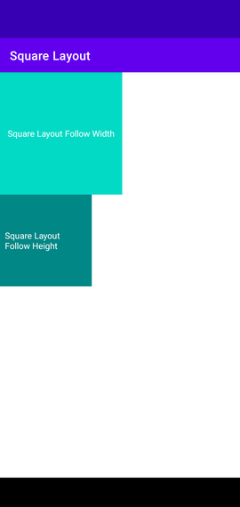

## android-squarelayout

### Sample


### Sample Usage
**Must specify width or height to make it work**

```
<me.quenchjian.squarelayout.SquareFrameLayout
    android:layout_width="200dp"
    android:layout_height="wrap_content"
    android:background="@color/teal_200"
    app:squareMode="follow_width">

    <TextView
        android:layout_width="wrap_content"
        android:layout_height="wrap_content"
        android:text="Square Layout Follow Width"
        android:textColor="@color/white"
        android:layout_gravity="center"
        tools:ignore="HardcodedText" />
</me.quenchjian.squarelayout.SquareFrameLayout>
```
```
<me.quenchjian.squarelayout.SquareCardView
    android:layout_width="wrap_content"
    android:layout_height="150dp"
    app:cardBackgroundColor="@color/teal_700"
    app:cardCornerRadius="15dp"
    app:squareMode="follow_height">

    <TextView
        android:layout_width="wrap_content"
        android:layout_height="wrap_content"
        android:text="Square Layout Follow Height"
        android:padding="8dp"
        android:textColor="@color/white"
        android:layout_gravity="center"
        tools:ignore="HardcodedText" />
</me.quenchjian.squarelayout.SquareCardView>
```

### License
Check [LICENSE](LICENSE)